# PLATEAU SDK-Maps-Toolkit for Unity 利用マニュアル

https://github.com/Project-PLATEAU/PLATEAU-SDK-Toolkits-for-Unity/assets/137732437/42bcee43-436a-45f4-9cd2-a306ed36b905

PLATEAUの3D都市モデルを用いた空間解析、可視化、建築情報との連携など、地図アプリ開発等を行うためのツールキットです。

- Maps Toolkit で提供される機能
    - Cesium for Unityとの連携
        - PLATEAU SDKによりインポートした3D都市モデルにCesium for Unity上でのグローバル座標を与えます。
        - PLATEAUがストリーミング提供する地形モデル (PLATEAU Terrain) を用いることで、高精度の地形モデルをCesium for Unityで利用可能になります。
    - BIMモデルとの連携（IFC ファイルの読み込み）
        - Revitなどで作られたIFCファイルをUnityシーン内に配置することができます。
        - IFCファイルに含まれる座標情報を用いてCesium for Unity上で自動的に配置することが可能です。
        - IFCファイルで定義される属性情報もUnity上で取り扱うことができます。
    - GISデータとの連携
        - シェープファイル及びGeoJSONをUnityシーン内に配置することができます。
        - シェープファイルのDBFファイルに含まれる座標情報を用いてCesium for Unity上で自動的に配置することが可能です。
        - シェープファイルのDBFファイル及びGeoJSONのプロパティで定義される属性情報もUnity上で取り扱うことができます。
     
### 更新履歴

| 更新日時 | 変更内容 |
| :--- | :--- |
|  2024/7/26  |  対応バージョンについて追記 |
|  2024/3/18  |  バグ修正 |
|  2023/12/25  |  Maps Toolkitを専用パッケージに分割 |
|  2023/10/28  |  Maps Toolkit初回リリース |

# 目次
<!-- @import "[TOC]" {cmd="toc" depthFrom=1 depthTo=3 orderedList=false} -->
<!-- code_chunk_output -->

- [PLATEAU SDK-Maps-Toolkit for Unity 利用マニュアル](#plateau-sdk-maps-toolkit-for-unity-利用マニュアル)
    - [更新履歴](#更新履歴)
- [目次](#目次)
- [セットアップ環境](#セットアップ環境)
  - [検証済環境](#検証済環境)
    - [推奨OS環境](#推奨os環境)
    - [Unity バージョン](#unity-バージョン)
    - [レンダリングパイプライン](#レンダリングパイプライン)
  - [PLATEAU SDKバージョン](#plateau-sdkバージョン)
- [導入手順](#導入手順)
  - [Unityでのプロジェクト作成](#unityでのプロジェクト作成)
  - [PLATEAU SDK-Maps-Toolkit for Unity のインストール](#plateau-sdk-maps-toolkit-for-unity-のインストール)
  - [Cesium for Unity のインストール](#cesium-for-unity-のインストール)
  - [IfcConvertのインストール](#ifcconvertのインストール)
  - [PLATEAU SDK for Unity を使って都市モデルをインポート](#plateau-sdk-for-unity-を使って都市モデルをインポート)
- [利用手順](#利用手順)
  - [1. PLATEAUモデル位置合わせ](#1-plateauモデル位置合わせ)
    - [1-1. シーンを用意する](#1-1-シーンを用意する)
    - [1-2. 地形モデルを作成する](#1-2-地形モデルを作成する)
    - [1-3. 地形モデルにPLATEAU Terrainを利用する](#1-3-地形モデルにplateau-terrainを利用する)
    - [1-4. 地形モデルにラスターをオーバーレイする](#1-4-地形モデルにラスターをオーバーレイする)
    - [1-5. Cesium for Unity上への3D都市モデルの配置](#1-5-cesium-for-unity上への3d都市モデルの配置)
    - [1-6. 3D都市モデルのストリーミング設定](#1-6-3d都市モデルのストリーミング設定)
  - [2. IFCモデルの読み込み](#2-ifcモデルの読み込み)
    - [2-1. IFCファイルをインポートする](#2-1-ifcファイルをインポートする)
    - [2-2. 属性情報を付与](#2-2-属性情報を付与)
    - [2-3. 指定した位置に配置](#2-3-指定した位置に配置)
    - [2-4. IFC属性情報から自動配置](#2-4-ifc属性情報から自動配置)
    - [2-5. IFC読み込みの環境設定](#2-5-ifc読み込みの環境設定)
  - [3. GISデータ読み込み](#3-gisデータ読み込み)
  - [ライセンス](#ライセンス)
  - [注意事項/利用規約](#注意事項利用規約)

<!-- /code_chunk_output -->

# セットアップ環境
## 検証済環境
### 推奨OS環境
- Windows 11
- macOS Ventura 13.2

### Unity バージョン
- 動作確認環境：Unity 2021.3.35、Unity 2022.3.25
- 推奨：Unity 2021.3.35以上

### レンダリングパイプライン
- URP
- HDRP

**Built-in Rendering Pipelineでは動作しません。**

## PLATEAU SDKバージョン
- [PLATEAU SDK for Unity v2.3.2](https://github.com/Project-PLATEAU/PLATEAU-SDK-for-Unity/releases/tag/v2.3.2)以上

# 導入手順

## Unityでのプロジェクト作成
新しく Unity プロジェクトを作成してください。
その際のテンプレートとして「3D (URP)」もしくは「3D (HDRP)」を選択してください。


## PLATEAU SDK-Maps-Toolkit for Unity のインストール

1. Unity エディターを開き、「Window」メニューから「Package Manager」を選択します。
2. 「Package Manager」ウィンドウの右上にある「＋」ボタンをクリックし、「Add package from tarball...」を選択します。
3. ファイル選択ダイアログが開いたら、PLATEAU SDK-Maps-Toolkit for Unityパッケージの tarball (.tgzファイル) を選択します。


新規作成したUnityプロジェクトに PLATEAU SDK-Maps-Toolkit for Unity をインストールすると、インストールされている他のパッケージに依存して入力システムについての確認ダイアログが表示される場合があります。その場合は「Yes」を選択してください（Unityエディタが再起動します）。


[ダウンロードリンクはこちら](https://github.com/Project-PLATEAU/PLATEAU-SDK-Maps-Toolkit-for-Unity/releases)

## Cesium for Unity のインストール

PLATEAU SDK-Maps-Toolkit for Unityでは一部の機能の利用には Cesium for Unity が必要です。Cesium for Unityがインストールされていない場合でもその他の機能は利用できますが、Cesium for Unityに依存する機能は以下のように表示され使用不可となります。

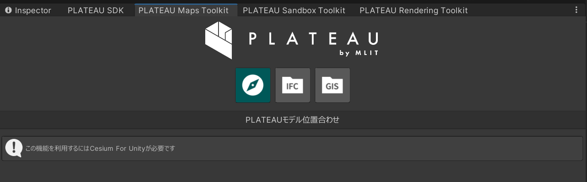
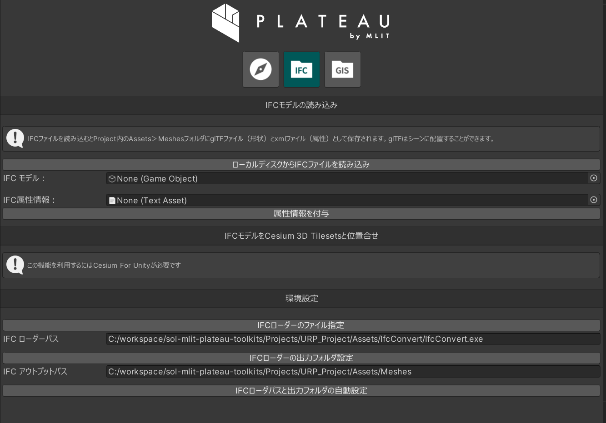
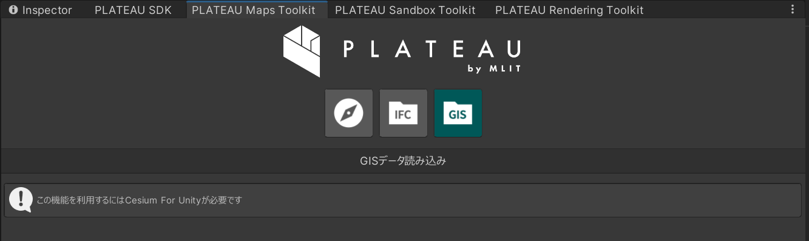

Cesium for Unityは下記のページよりダウンロードしてください。PLATEAU SDK-Maps-Toolkitではバージョンv1.6.3をサポートしています。

- [Cesium for Unity v1.6.3](https://github.com/CesiumGS/cesium-unity/releases/tag/v1.6.3)

ダウンロードしたtarball(.tgzファイル)は PLATEAU SDK-Maps-Toolkit を使用する Unity プロジェクトのフォルダ内に配置することを推奨します。Unity プロジェクトのフォルダに配置することで、相対パスでパッケージを参照することができ、フォルダを移動したり別の環境での同じプロジェクトの利用が容易になります。Unityプロジェクト外を参照すると、絶対パスがmanifest.jsonに書き込まれることになり、少し不便になり、依存解決のエラーなどが将来的に発生してしまう可能性があります。

Windows > PackageManagerの「Add package from tarball…」を選択し、ダウンロードした Cesium for Unity の tgz ファイルを選択します。


## IfcConvertのインストール
IFC読み込みなどの一部の機能の利用にはIfcConvertをインストールする必要があります。該当の機能の使用時に表示されるメッセージに従い、IfcConvertをインストールしてください。

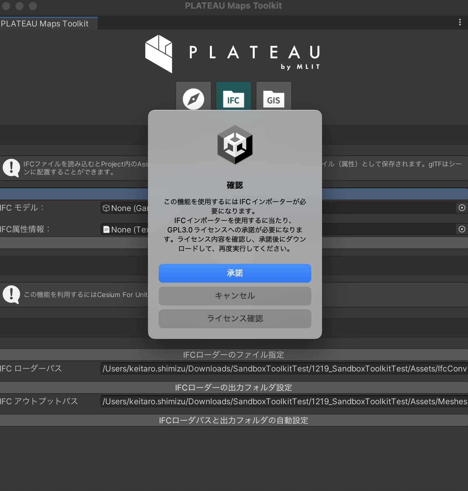

- [IfcOpenShellについて](https://ifcopenshell.org/)
- [IfcConvertの利用方法](https://blenderbim.org/docs-python/ifcconvert/installation.html)
- [ソースコードリポジトリ](https://github.com/IfcOpenShell/IfcOpenShell)
- [ライセンス(GNU Lesser General Public License v3.0)](https://github.com/IfcOpenShell/IfcOpenShell/blob/v0.7.0/COPYING)


## PLATEAU SDK for Unity を使って都市モデルをインポート

PLATEAU SDK for Unityをインストールしていていない場合は、[マニュアルの手順](https://project-plateau.github.io/PLATEAU-SDK-for-Unity/manual/Installation.html)に従ってインストールします。

同じく、PLATEAU SDK for Unity[「都市モデルのインポート」の手順](https://project-plateau.github.io/PLATEAU-SDK-for-Unity/manual/ImportCityModels.html)に従って都市モデルをUnityエディターへインポートして、本Toolkitの利用を開始してください。

# 利用手順

上部のメニューより PLATEAU > PLATEAU Toolkit > Maps Toolkit を選択し、Maps Toolkit ウィンドウを開いて、それぞれの機能を利用することができます。


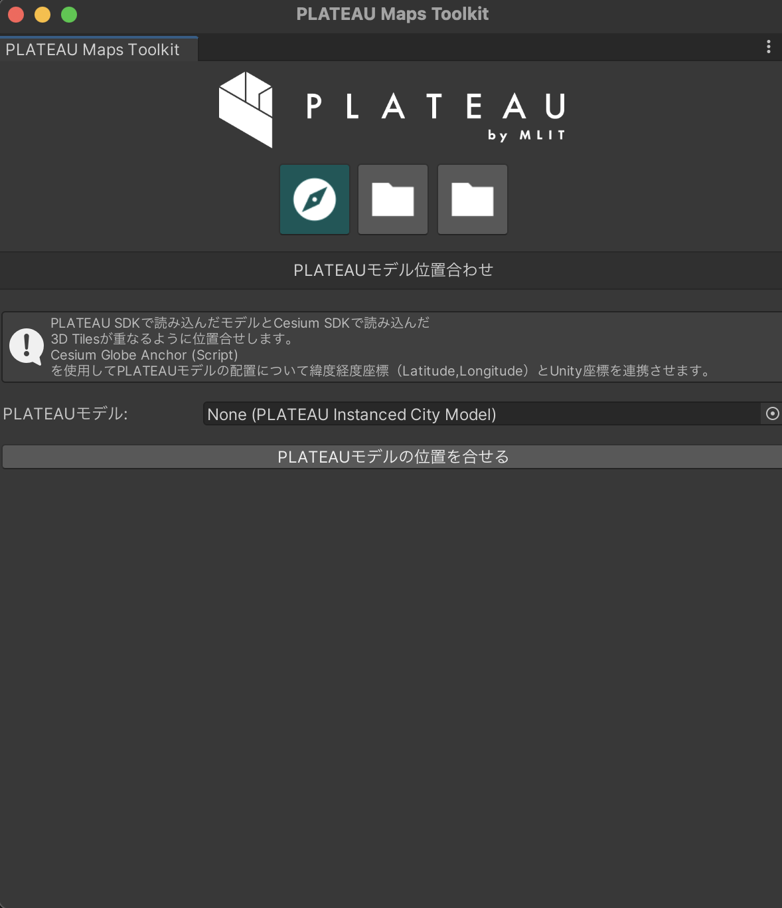


## 1. PLATEAUモデル位置合わせ

### 1-1. シーンを用意する

3D都市モデルを利用するシーンを用意し、開いてください。

### 1-2. 地形モデルを作成する

Unityエディターのメニューから Cesium > Cesium を選択し、Cesium ウィンドウを開きます。

Cesiumウィンドウの「Quick  Basic Assets」メニューの下にある 「Blank 3D Tiles Tileset」をクリックし、シーン上に3D地形モデルオブジェクトを作成します。


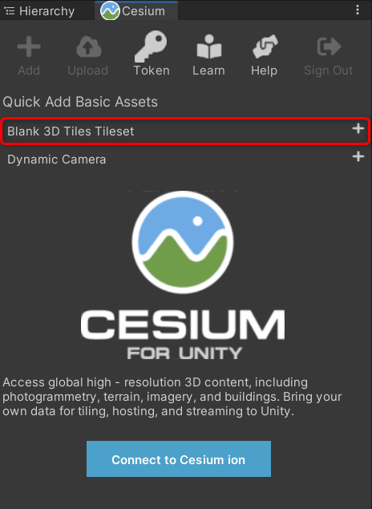


シーンに「CesiumGeoreference」という名前のゲームオブジェクトが作成されていることを確認してください。また、ヒエラルキーで「Cesium3DTileset」というオブジェクトがCesiumGeoreference の子オブジェクトとして作成されており、このオブジェクトの `Cesium 3D Tileset` というコンポーネントに地形モデルの設定を行います。


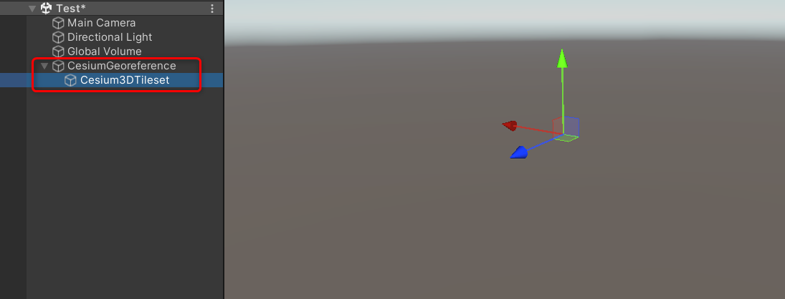


### 1-3. 地形モデルにPLATEAU Terrainを利用する

> **Note**
> 地形モデルにPLATEAUの地形モデルを使用しない場合(Cesium World Terrainを利用する場合など)は3D都市モデルと地形モデルの地面の形状が合わず、3D都市モデルに含まれる建物が地面に埋まってしまったり、地面から浮いてしまう場合があります。
> このため、PLATEAUで提供している地形モデル ([PLATEAU Terrain](https://github.com/Project-PLATEAU/plateau-streaming-tutorial/blob/main/terrain/plateau-terrain-streaming.md)) を利用することを推奨します。

ヒエラルキーの「Cesium3DTileset」オブジェクトを選択し、インスペクターから `Cesium 3D Tileset` コンポーネントの `ion Asset ID` と `ion Access Token` を変更します。  
ここでは、[PLATEAU配信サービス（試験運用）](https://github.com/Project-PLATEAU/plateau-streaming-tutorial)が提供する地形モデル（PLATEAU Terrain）を利用することができます。
チュートリアルの「**[2.1. アクセストークン及びアセットID](https://github.com/Project-PLATEAU/plateau-streaming-tutorial/blob/main/terrain/plateau-terrain-streaming.md#21-%E3%82%A2%E3%82%AF%E3%82%BB%E3%82%B9%E3%83%88%E3%83%BC%E3%82%AF%E3%83%B3%E5%8F%8A%E3%81%B3%E3%82%A2%E3%82%BB%E3%83%83%E3%83%88id)**」に記載されている値を入力します。

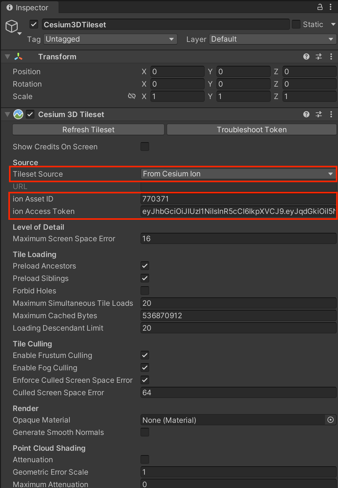


正しく設定されていれば、シーンにPLATEAUの地形モデルが描画されます（表示されない場合は `Cesium 3D Tileset` コンポーネントの上部にある「Refresh Tileset」ボタンを押してください）。この時点ではテクスチャを設定していないため、単色のメッシュのみが表示されています。

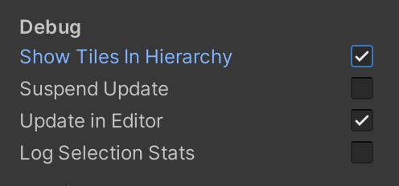

なお、ヒエラルキーではメッシュのゲームオブジェクトは非表示なっていますが、 `Cesium 3D Tileset` の `Show Tiles in Hierarchy` を有効にすることで表示させることができます。メッシュオブジェクトは `Cesium 3D Tileset` コンポーネントがアタッチされているゲームオブジェクトの子オブジェクトとして生成されています。


### 1-4. 地形モデルにラスターをオーバーレイする

Cesium 3D Tilesetによって配置された地形モデルにテクスチャを付与するためにはCesium for UnityのRaster Overlay機能を利用します。
Raster Overlay機能はWMS（Web Map Service）形式で配信される画像データを地形モデルにオーバーレイすることができます。

> **Note**
> [PLATEAU配信サービス（試験運用）](https://github.com/Project-PLATEAU/plateau-streaming-tutorial)ではPLATEAUが提供する航空写真データである[PLATEAU Ortho](https://github.com/Project-PLATEAU/plateau-streaming-tutorial/blob/main/ortho/plateau-ortho-streaming.md)をxyzタイルで提供していますが、Cesium for UnityのRaster Overlay機能ではxyzタイルを表示することができません。  
> そこで、本機能で空中写真を扱えるよう、PLATEAU Orthoと地理院タイルを統合したWMS形式データを用意しました。
>
> WMS形式データには、PLATEAU Orthoのみの配信（Layers:plateau）とPLATEAU Orthoと地理院タイルを統合したデータ（Layers:plateau_photo）の2種類が利用可能です。
>
> 配信URLは以下になります。自由にご利用ください。  
> https://plateauortho.geospatial.jp/mapproxy/service

「Cesium3DTileset」オブジェクトのインスペクタから「Add Componet」を押下し `Cesium Web Map Service Raster Overlay` コンポーネントを追加します。

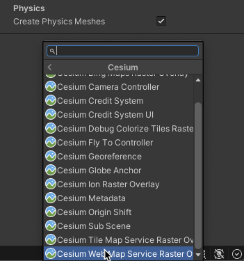

Base URLにWMS配信URLを設定します。

今回はPLATEAU Ortho WMSを利用するため、
`https://plateauortho.geospatial.jp/mapproxy/service`を設定します。

Layersに`plateau`を設定します。

Maximum Levelは最大`19`まで設定可能です（拡大し詳細なテクスチャを表示させたい場合は19に設定）。

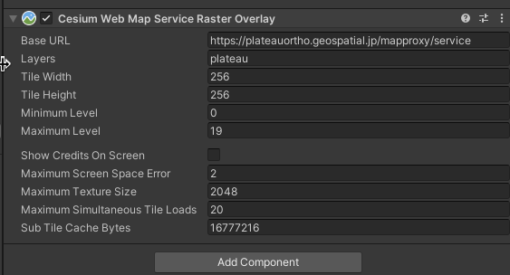

Cesium3DTilesetの地形モデルにテクスチャが表示されるようになります。

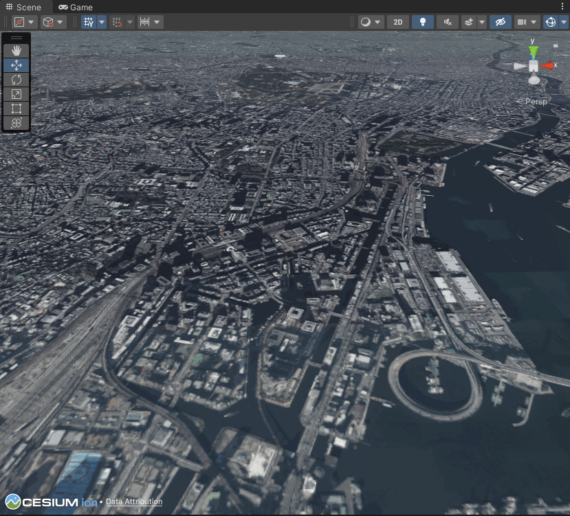

> **Note**
> WMS形式データには、PLATEAU Orthoのみの配信（Layers:plateau）とPLATEAU Orthoと地理院タイルを統合したデータ（Layers:plateau_photo）の2種類が利用可能です。
>
> Lyayersの値を`plateau_photo`に変更すると地理院タイルとPLATEAU航空写真が統合されたラスターをオーバーレイすることができます。
>
> Base URLには引き続きPLATEAU Ortho WMSの配信URLを設定します。`https://plateauortho.geospatial.jp/mapproxy/service`
> 
> PLATEAU Ortho WMSはPLATEAUが独自に取得した空中写真と地理院タイルを統合した全国の空中写真です。 ウェブサイトやソフトウェア、アプリケーション上でリアルタイムに読み込んで利用する場合、出典の明示が必要となります。詳しくは「[地理院タイルのご利用について](https://maps.gsi.go.jp/development/ichiran.html)」をご参照ください。
> 
> 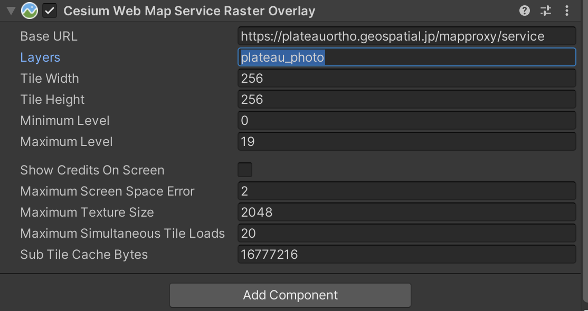
>
> 表示結果 <br>
>
> 


#### 参考：Cesium ionのラスターをオーバーレイに使用する
ここではテクスチャ画像にCesiumから提供される航空画像テクスチャを使用しますが、この場合 Cesium Ion アカウントへ接続し、アクセストークンを取得する必要があります。 
Cesiumから提供されるテクスチャが不要の場合はこの手順をスキップしてください。
##### Cesium Ion アカウントへの接続

PLATEAUの地形モデルの利用のみでCesiumのその他のアセットやBing Mapsなどの外部アセットデータを利用しない場合は接続する必要はありません。

ログインするためにはCesiumウィンドウから「Connect to Cesium ion」を押下し、表示されるURLをコピーしてブラウザで開きます。

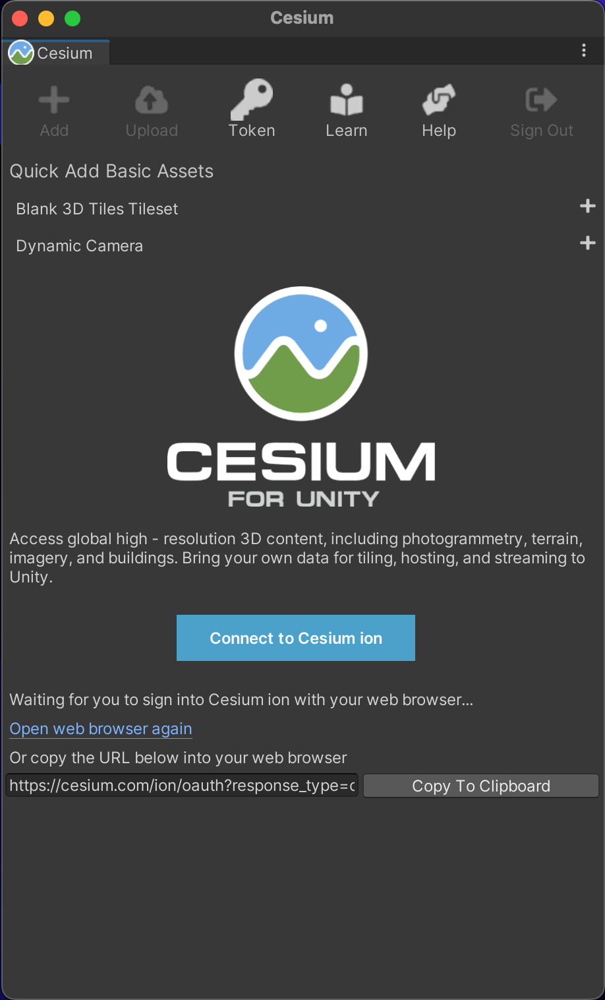

ログイン画面が表示されるので、アカウント情報を入力してログインします。アカウントがない場合はCesium ionの[サインアップ](https://ion.cesium.com/signup/)をしてください。

##### Cesium サインイン
ユーザー名、パスワードを入力してサインインします。

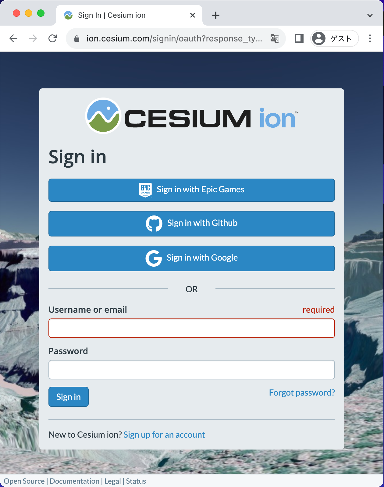

ログインに成功すると、次のような画面が表示されるので「Allow」を押下します。

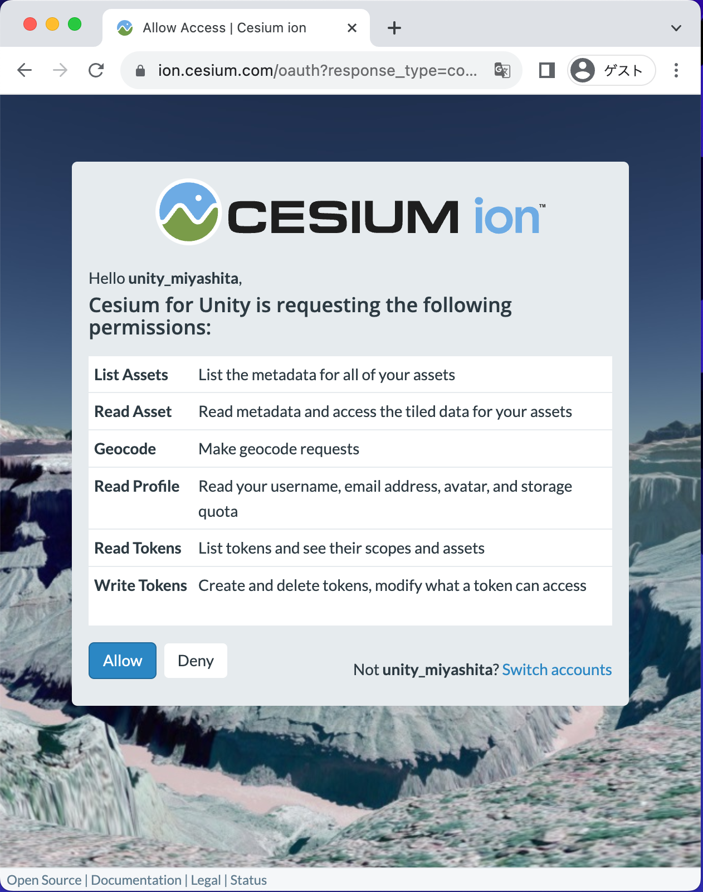

正しくログインが完了すると、Cesiumウィンドウに Cesium ion Assets を用いた機能など、Cesiumへのログインが必要な機能が利用可能になります。

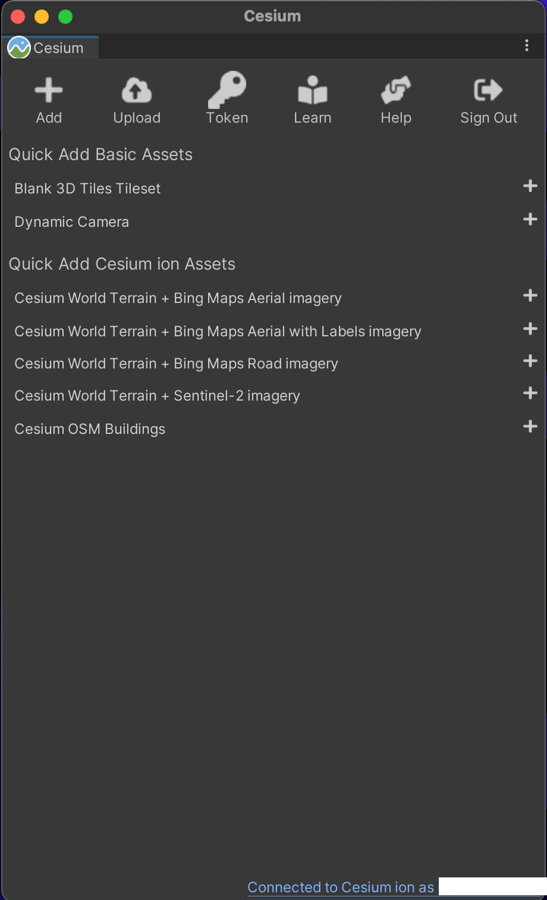

##### ラスターオーバーレイ設定

「Cesium3DTileset」オブジェクトのインスペクタから「Add Componet」を押下し `Cesium Ion Raster Overlay` コンポーネントを追加します。

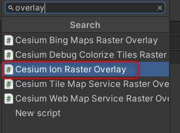


追加した `Cesium Ion Raster Overlay` コンポーネントの `ion Asset ID` を 2 に変更します。

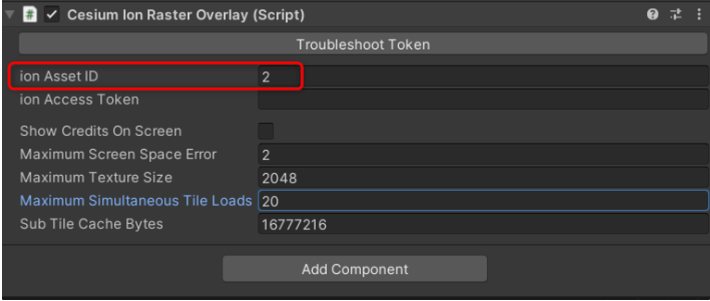


この状態で、決定しようとすると、下記のようなダイアログが表示され、access tokenが求められます。「Select or create a new project default token」を選択してください。

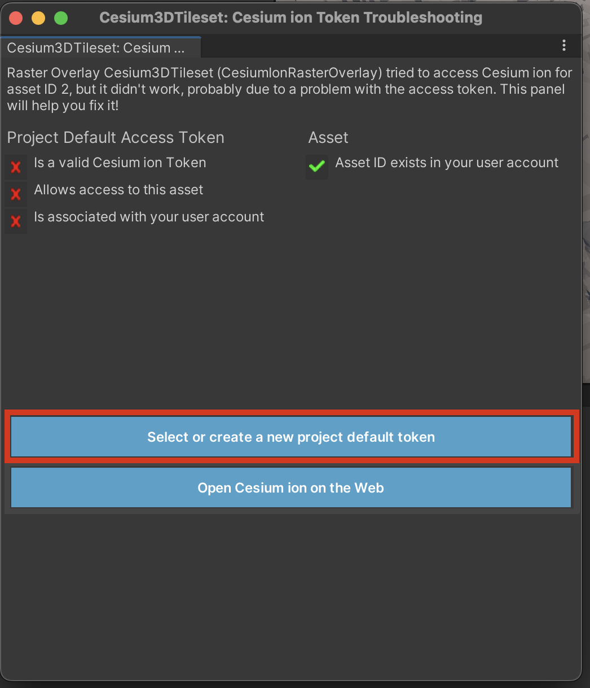

「Select Cesium ion Token」ダイアログが開くので、「Use an existing token」にチェックを入れ、プルダウンの「Default Token」を選択します。入力したら「Use as Project Default Token」ボタンを押下します。

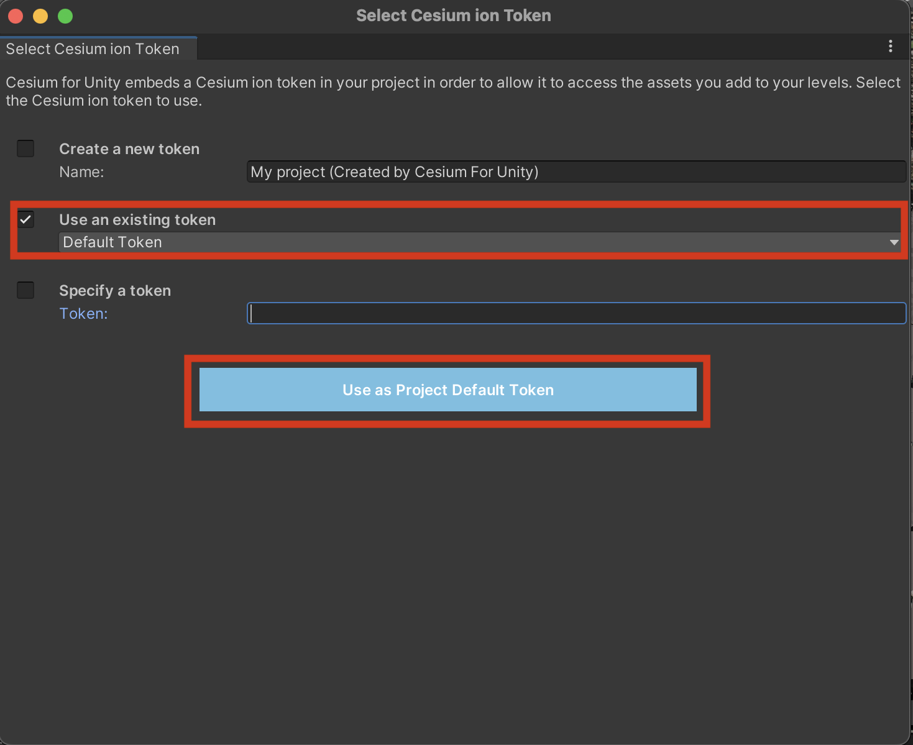


Cesium3DTilesetの地形モデルにテクスチャが表示されるようになります。

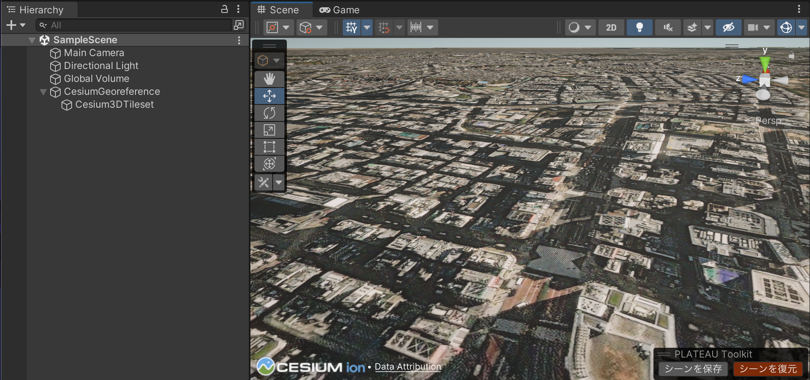


### 1-5. Cesium for Unity上への3D都市モデルの配置

#### Cesium Globe Anchor を3D都市モデルに設定する

PLATEAU SDKを用いて配置された3D都市モデルにCesium for Unity上でのグローバル座標を付与するため、3D都市モデルオブジェクト に `Cesium Globe Anchor` コンポーネントをアタッチします。このコンポーネントがアタッチされたオブジェクトを `Cesium Georeference` の子オブジェクトとすることで、 `Cesium Georeference` の座標に基づきシーン上に配置することが可能です。

ヒエラルキー上でインポートしてある3D都市モデルを `CesiumGeoreference` の子オブジェクトとして配置します（左図が配置変更前、右図が配置変更後になります）。

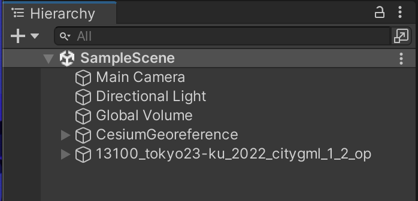 

3D都市モデルオブジェクトのインスペクタ上で「Add Component」を押下し、 `Cesium Globe Anchor` を選択してアタッチします。これで3D都市モデルを位置合わせするための準備は完了です。

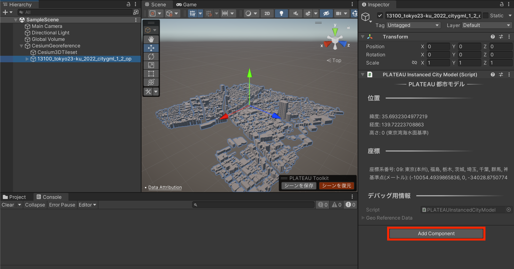
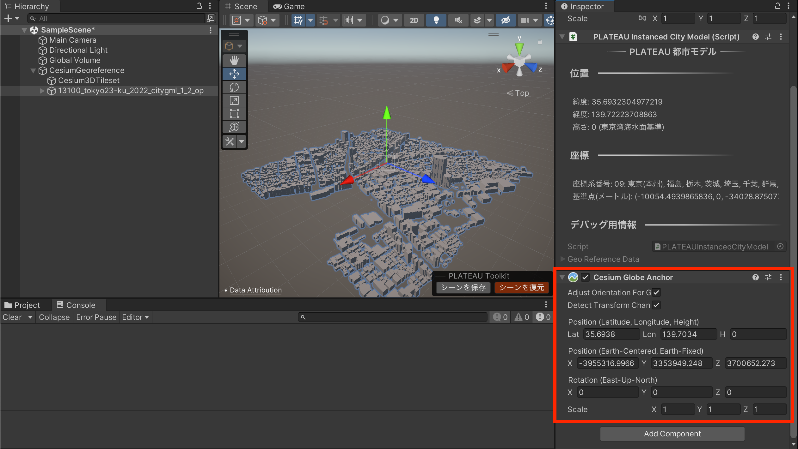

#### 位置合わせを実行する

Maps Toolkit ウィンドウの `PLATEAUモデル` フィールドにシーン上の3D都市モデルオブジェクトを設定します（ヒエラルキーからドラッグアンドドロップして設定できます）。

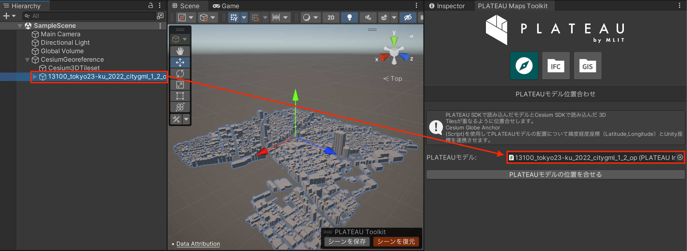


「PLATEAUモデルの位置を合わせる」を押すと選択した3D都市モデルオブジェクトがCesiumの地形モデル上で正しい位置に配置されます。

(例) 上記の設定で東京タワー周辺のPLATEAU建築物モデルの位置合わせの実行結果


> **Note**
**位置合わせ**を実行すると`PLATEAU Instanced City Model`オブジェクトの緯度経度高さが`Cesium Georeference` ゲームオブジェクトのコンポーネントの `Origin (Longitude Latitude Height)`の値へ自動的に入力されます。

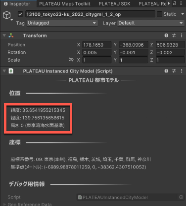

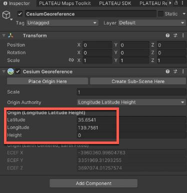


> **Warning**
> `Cesium Georeference`の*緯度・経度・高度は、大きい値を取り扱う際に生じる小数の計算誤差問題をさけるために、利用する3D都市モデルの近くの緯度経度に設定する必要があります（一般的にはこの座標中心が利用する3D都市モデルから10㎞以上離れている場合に計算誤差が発生します）。*

### 1-6. 3D都市モデルのストリーミング設定

PLATEAU SDK によって特定の範囲の3D都市モデルをインポートする他に、Cesiumを利用してその周辺の3D都市モデルを表示することで、全体的な景観などを確認することができます。

#### ストリーミング用の `Cesium 3D Tileset` オブジェクトの作成

Cesium ウィンドウから再度「Blank 3D Tiles Tileset」を押下し、新しい `Cesium 3D Tileset` オブジェクトを作成します。このとき、既にシーン内に `Cesium Georeference` オブジェクトが存在する場合はそのオブジェクトの子オブジェクトとして作成されます。

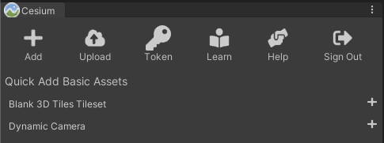


#### ストリーミングURLを設定

`Cesium 3D Tileset` の `Tileset Source` を「From Url」に変更します。

次に、 [PLATEAU配信サービス（試験運用）](https://github.com/Project-PLATEAU/plateau-streaming-tutorial)から配信されている3D都市モデル（3DTiles)の利用の設定を行います。  
3D都市モデル（3DTiles）は都市単位でURLが設定されているため、以下のページからストリーミングしたい地域を選び、 `URL` に入力します。

plateau-3D Tiles-streaming

- https://github.com/Project-PLATEAU/plateau-streaming-tutorial/blob/main/3d-tiles/plateau-3dtiles-streaming.md

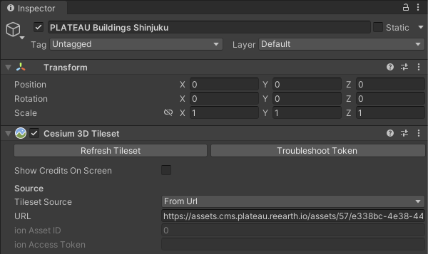


なお、複数の地域をまたがる場所の開発を行う場合は、これまでの手順を参考に `Cesium 3D Tileset` オブジェクトを作成し、それぞれURLを設定してください。

ストリーミング3D都市モデルを追加することで、下図のように青いアウトラインのあるインポートされた3D都市モデルの周囲の建物を表示することができます。

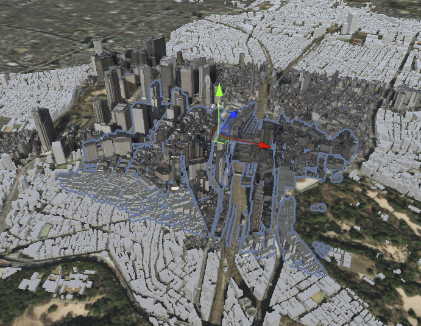


**ストリーミングされる3D都市モデルの範囲設定**

ここまでの手順で周囲の3D都市モデルを表示することができますが、インポートした部分の3D都市モデルも重複して表示されています。

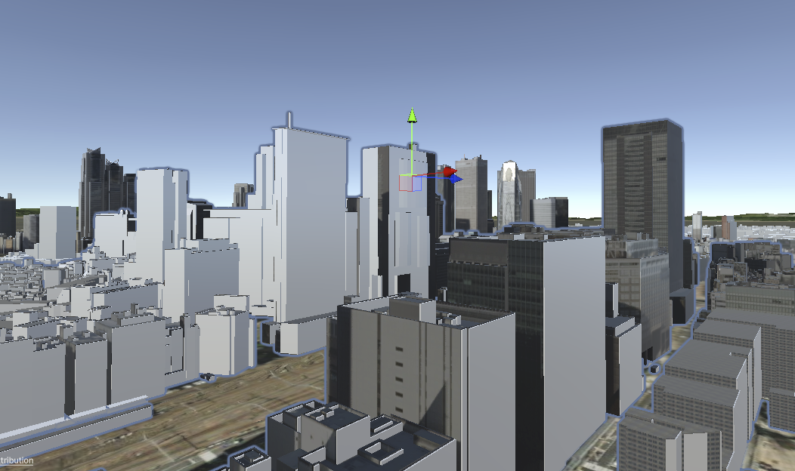

Cesium では特定の領域の建物の表示を制限する仕組みが用意されているため、ここではその仕組を用いてインポートされた3D都市モデルがストリーミングされる3D都市モデルと重複しないような設定を行います。

Cesiumには `CesiumTileExcluder` というクラスが用意されており、このクラスを継承したクラスに3D Tileを除外するルールを記述することで表示範囲を制限することができます。

ここでは以下の GitHub ページで紹介さている方法を用いた3D Tilesの除外方法を説明します。

https://github.com/CesiumGS/cesium-unity/pull/248


次のようなスクリプトを作成し、プロジェクト内に保存します。
```csharp
using CesiumForUnity;
using UnityEngine;

[ExecuteInEditMode] // エディター上でも確認できるように追加
[RequireComponent(typeof(BoxCollider))]
public class CesiumBoxExcluder : CesiumTileExcluder
{
    BoxCollider m_BoxCollider;
    Bounds m_Bounds;

    protected override void OnEnable()
    {
        m_BoxCollider = gameObject.GetComponent<BoxCollider>();
        m_Bounds = new Bounds(m_BoxCollider.center, m_BoxCollider.size);

        base.OnEnable();
    }

    protected void Update()
    {
        m_Bounds.center = m_BoxCollider.center;
        m_Bounds.size = m_BoxCollider.size;
    }

    public bool CompletelyContains(Bounds bounds)
    {
        return Vector3.Min(this.m_Bounds.max, bounds.max) == bounds.max &&
               Vector3.Max(this.m_Bounds.min, bounds.min) == bounds.min;
    }

    public override bool ShouldExclude(Cesium3DTile tile)
    {
        if (!enabled)
        {
            return false;
        }

        return m_Bounds.Intersects(tile.bounds);
    }
}
```

範囲を制限したい `Cesium 3DTileset` オブジェクトに作成した `CesiumBoxExcluder` をアタッチします。このコンポーネントをアタッチしたときに自動的にアタッチされる `Box Collider` というコンポーネントの利用することで範囲を設定します。 `Box Collider` は箱型の衝突を検知するためのコンポーネントですが、ここではシーン上で簡単に範囲を確認できる機能として利用しています。

 `CesiumBoxExcluder` の `Invert` をオンにすると `Box Collider` の外側の3D Tilesのみが表示され、オフにすると内側のみが表示されます。

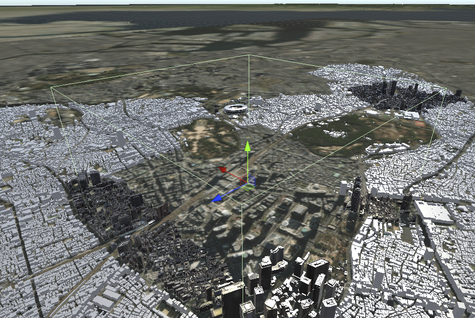


## 2. IFCモデルの読み込み

IFC読み込みツールでは読み込んだIFCモデルを選択し、以下のような操作を行うことが可能です。
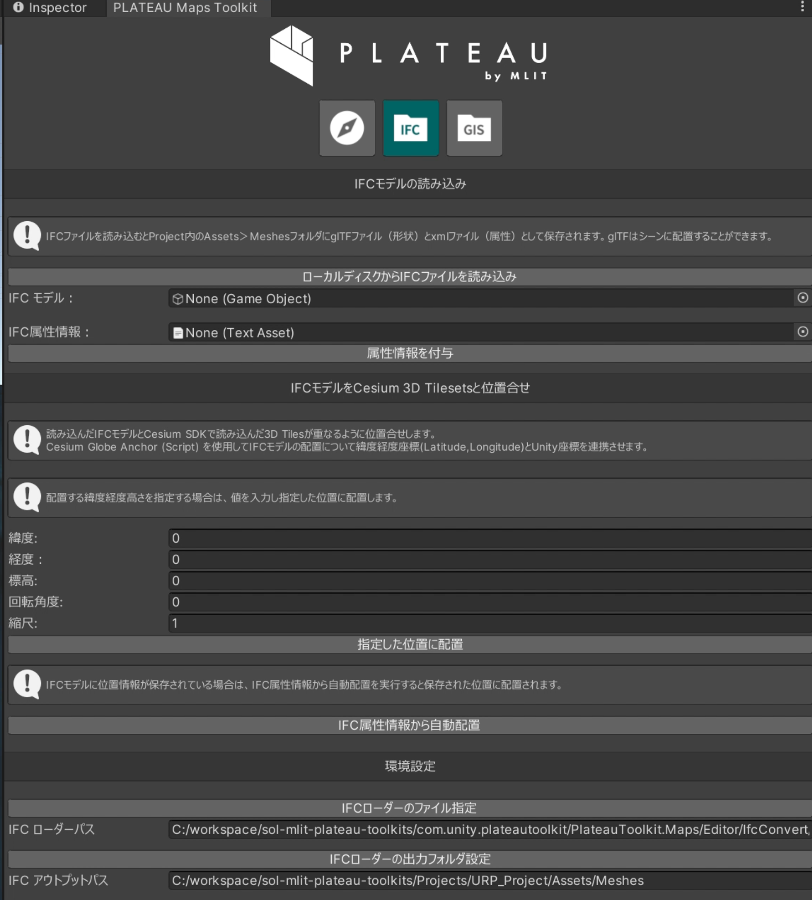


| 項目 | 説明 |
| --- | --- |
| IFCモデル | 操作するIFCモデルを設定します。 |
| IFC属性情報 | IFCファイルを読み込んだ際に保存されたXMLファイルを設定します。 |
| 属性情報を付与 | IFCファイルの属性情報をUnity上のIFCモデルに関連付けします。これにより、そのIFCの位置などの属性情報をUnity上で利用することができます。 |
| 指定した位置に配置  | 指定された項目を入力し、取り込んだIFCモデルを指定した位置に配置します。 |
| IFC属性情報から自動配置  | 設定した属性情報をもとに自動的にIFCモデルを配置します。属性情報に緯度経度情報が含まれない場合は使用できません。この機能を使用する際は「IFC属性情報」にXMLファイルを指定する必要があります（属性情報を付与していてもXMLファイルの指定が必要です）。 |

以降では、上記の各操作について手順を説明します。

> **Note**
> PLATEAUでは3D都市モデルと互換性のあるBIMモデルとしてIFC2x3を指定し、必要なデータ仕様を定義しています。
> 特に座標情報を付与したIFCファイルを扱う場合は、PLATEAUが定義するデータ仕様に則る必要があります。
> 詳細は以下のドキュメントを参照してください。  
> - 「[3D都市モデル整備のためのBIM活用マニュアル 第2.0版](https://www.mlit.go.jp/plateau/file/libraries/doc/plateau_doc_0003_ver03.pdf)」  
> -  [「3D都市モデルとの連携のためのBIMモデルIDM・MVD 第2.0版」](https://www.mlit.go.jp/plateau/file/libraries/doc/plateau_doc_00031_ver02.pdf)  
 
### 2-1. IFCファイルをインポートする

「ローカルディスクからIFCファイルを読み込み」を押下し、ファイル選択ウィンドウが表示されるので読み込むIFCファイルを選択します。

[リリースページ](../../releases/tag/SampleFiles)からIFCのサンプルファイルをダウンロードできます。以下の手順では[sample.ifc](../../releases/download/SampleFiles/sample_r2_2x3AC.ifc)を用いて説明します。

 PLATEAU都市モデルとBIMモデル（ここではIFCファイル）を活用するにあたって詳細は「[3D都市モデル整備のためのBIM活用マニュアル](https://www.mlit.go.jp/plateau/file/libraries/doc/plateau_doc_0003_ver03.pdf)」をご参照ください。
 
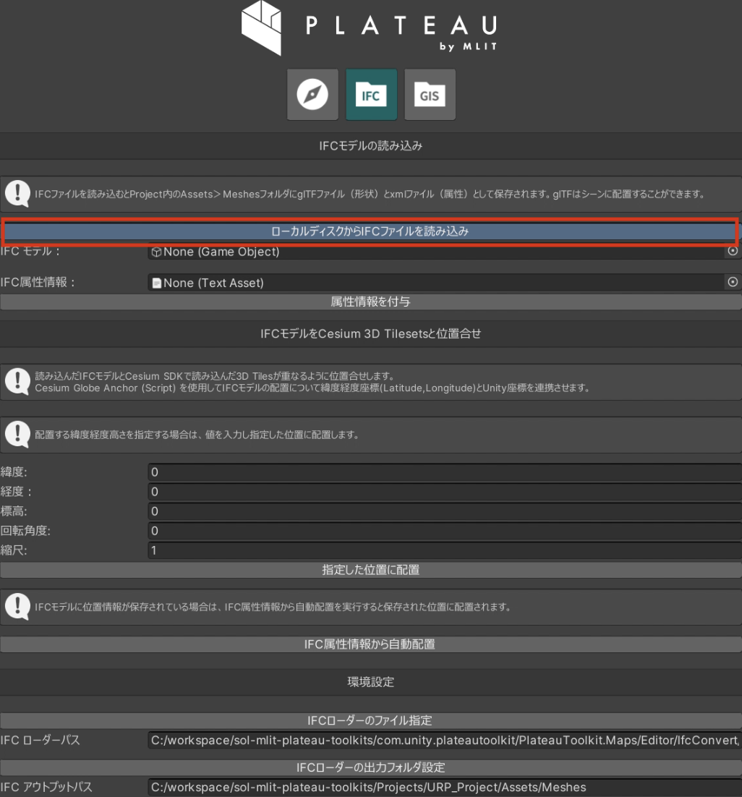

コンソール画面が開き、読み込みと変換処理が開始されます。（時間がかかる場合があります。）

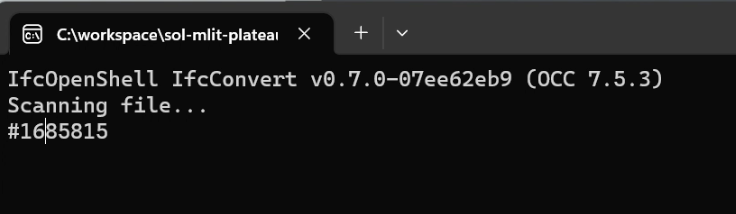


完了するとプロジェクト内のAssets/MeshesフォルダにGLBファイルとXMLファイルが保存されます。

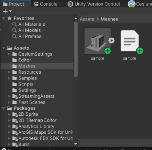


インポートしたGLBファイルは、シーンにドラッグドロップして配置することができます。

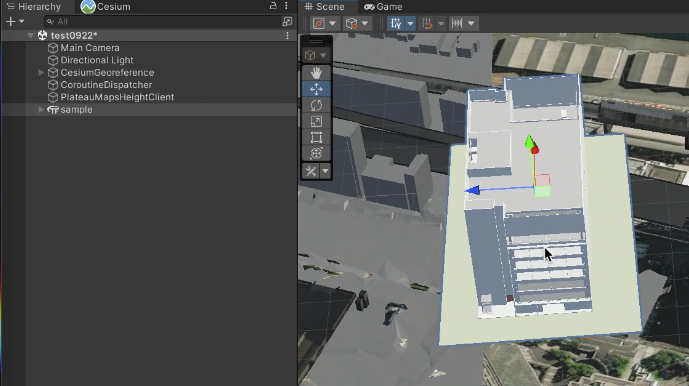


### 2-2. 属性情報を付与

「ローカルディスクからIFCファイルを読み込み」によってIFCを読み込んだ結果、Assets/MeshesフォルダにGLBファイル（3Dモデル）とXMLファイル（属性情報）が作成されます。

「属性情報を付与」機能ではUnityエディタ内でGLBファイル（3Dモデル）とXMLファイル（属性情報）の関連付けを行いいます。

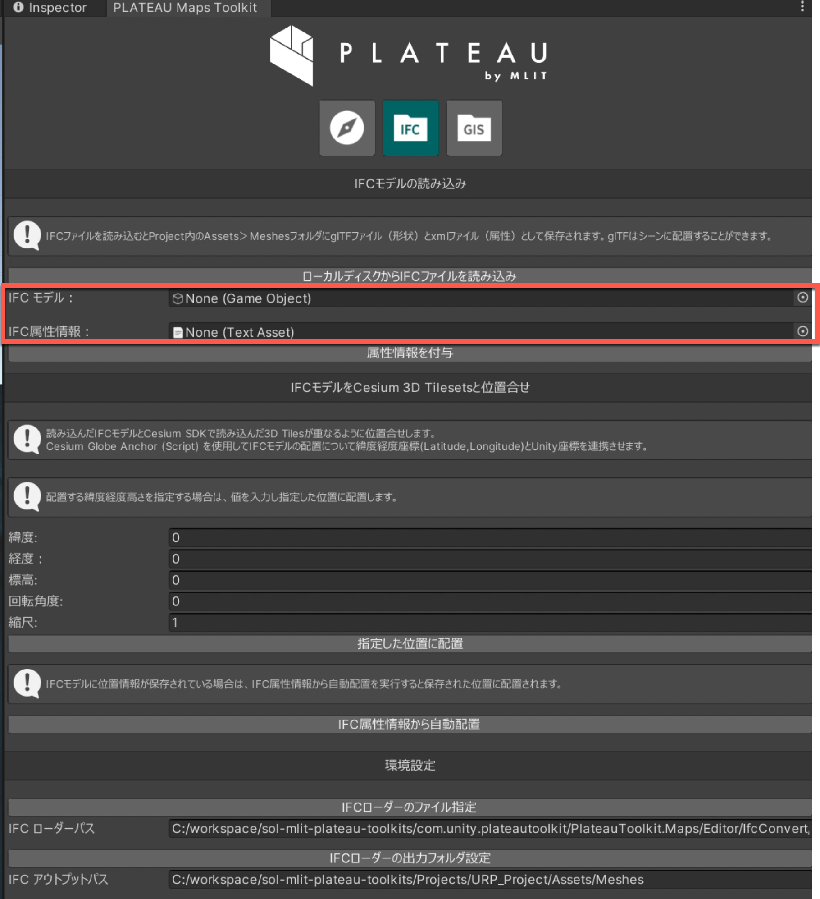


IFCモデルの項目には、ヒエラルキーからGLBのゲームオブジェクトをドラック＆ドロップして設定します。

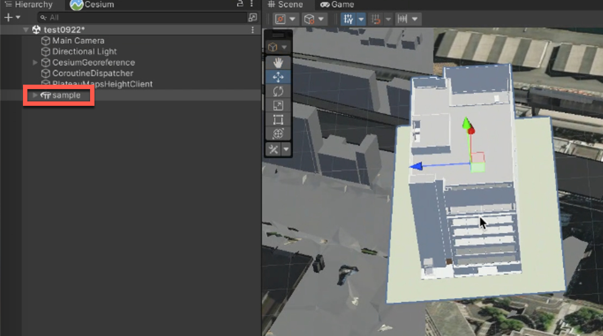


IFC属性情報の項目には、Assets/MeshesフォルダからXMLファイルをドラック＆ドロップして設定します。

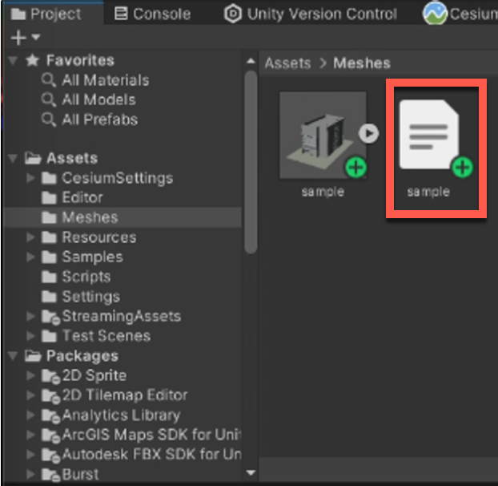


最後に「属性情報を付与」ボタンをクリックするとIFCファイルの属性情報をUnity上のIFCモデルに関連付けされ、位置情報などの属性情報をUnity上で利用することができます。

### 2-3. 指定した位置に配置

ヒエラルキーにて、GLBオブジェクト（IFCを読み込んだ結果）を`Cesium Georeference`の子オブジェクトに設定します。


さらにGLBオブジェクトのインスペクタ上で「Add Component」を押下し、 `Cesium Globe Anchor` を選択してアタッチします。これで自動配置するための準備は完了です。

読み込んだIFCモデルを指定された緯度、経度、標高に配置します。また回転角度、縮尺を設定することができます。

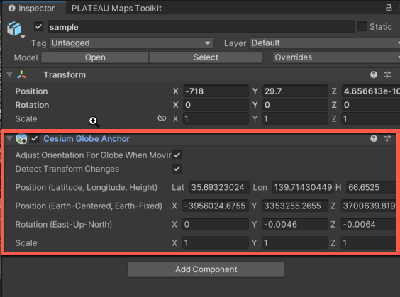


### 2-4. IFC属性情報から自動配置

IFC属性情報に位置情報が保存されている場合、その情報を元にモデルを配置します。

あらかじめ「属性情報を付与」機能を使用してモデルと属性情報を関連付けさせておく必要があります。

ヒエラルキーにて、GLBオブジェクト（IFCを読み込んだ結果）を`Cesium Georeference`の子オブジェクトに設定します。


さらにGLBオブジェクトのインスペクタ上で「Add Component」を押下し、 `Cesium Globe Anchor` を選択してアタッチします。これで自動配置するための準備は完了です。

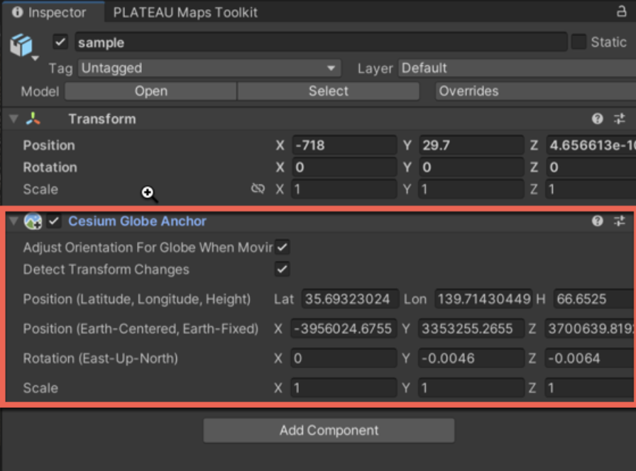


「IFC属性情報から自動配置」ボタンを押すとモデルが配置されます。

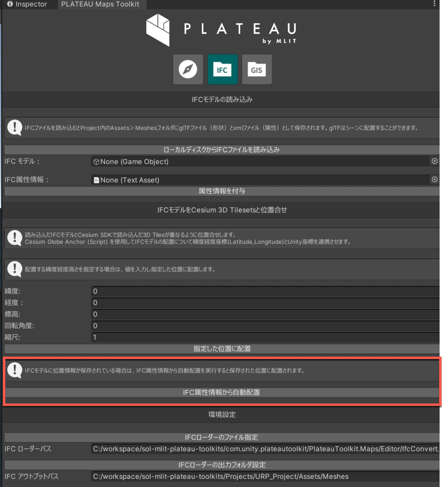

#### 配置結果


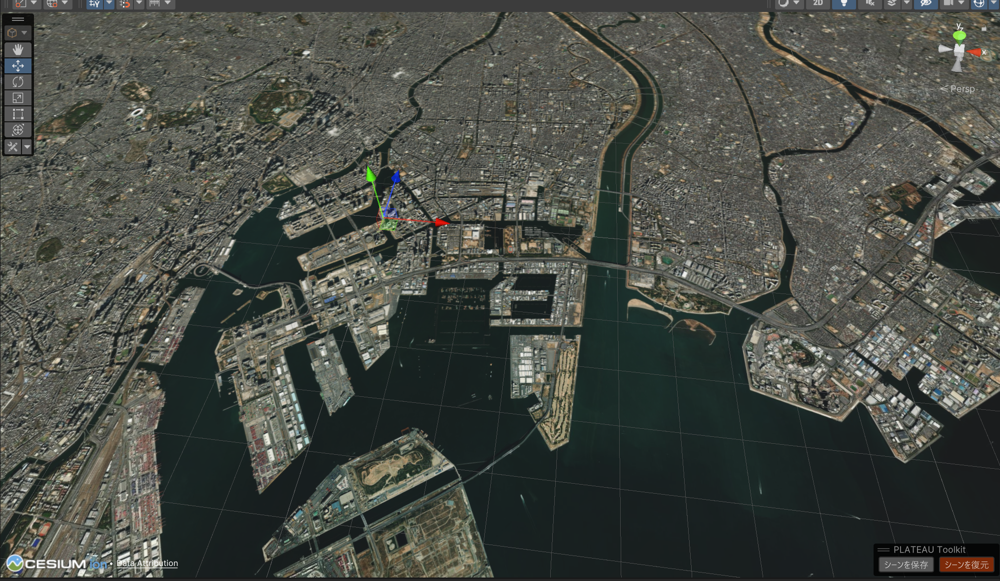


### 2-5. IFC読み込みの環境設定
| 項目 | 説明 |
| --- | --- |
| IFC ローダーパス | IFCローダー (IfcConvert) はWindowsでは基本的に変更する必要はないですが、 macOS では選択する必要があります（後述）。 |
| IFC アウトプットパス | 生成されるファイルの出力先フォルダは、デフォルトではUnityプロジェクト内の Assets/Meshes に設定されていますが、 IFC アウトプットパス を設定することで別のフォルダを指定することができます。 |

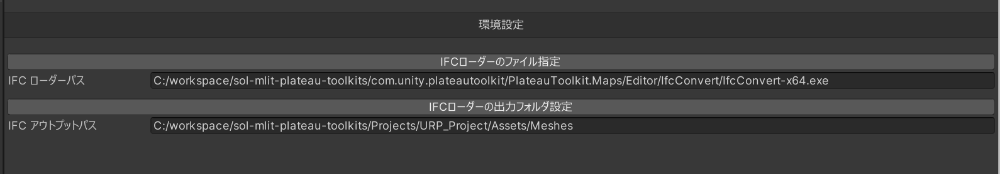


#### macOSについて

macOSではmacOSのセキュリティ機能により、Maps Toolkit を利用する上で追加の設定が必要です。

##### Maps Toolkit が利用する IfcConvert の利用を許可する

IfcConvertとはMaps ToolkitでIFCファイルを読み込む際に利用するファイルです。このファイルの実行をmacOS上で許可しない場合、Maps ToolkitのIFC読み込みが利用できません。

macOSでは、セキュリティ面の観点からダウンロードしたバイナリは実行が許可されていないため、手動で許可する必要があります。「ターミナル」アプリを開き、で上記のバイナリのフォルダまで移動し以下のコマンドを実行します。

PLATEAU SDK Toolkits for Unity をインストールしたあとmacOSでは以下のフォルダにIfcConvertの実行ファイルがインストールされています。

`{インストールしたUnityプロジェクトのフォルダパス}/Library/PackageCache/com.unity.plateautoolkit@{ハッシュ}/PlateauToolkit.Maps/Editor/IfcConvert/`

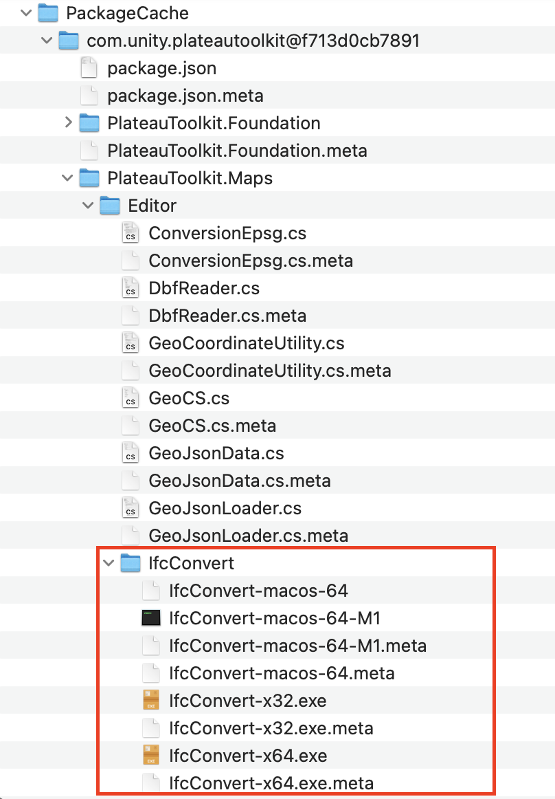


> **Warning**
>  上記の画像の`com.unity.plateautoolkit@f713d0cb7891` の`f713d0cb7891`はインストールごとに生成されるIDなので環境によって異なります。

上記のフォルダの中に4つの実行ファイルがあります。

1. IfcConvert-macos-64 (Intel系CPU)
2. IfcConvert-macos-64-M1 (Apple Silicon系CPU)
3. IfcConvert-x32.exe
4. IfcConvert-x64.exe

exe形式の実行ファイルはWindows向けなので、以降の手順では(1) か (2) を自分のmacOS環境（CPU）に合わせて選んでください。

`IfcConvert-macos-64-M1 {IFCファイルのパス} {出力するGLBファイルのパス}`

(例) `IfcConvert-macos-64-M1 Test.ifc Test.glb`

“Permission Denied” が表示されていれば環境設定のセキュリティ画面を開きます。

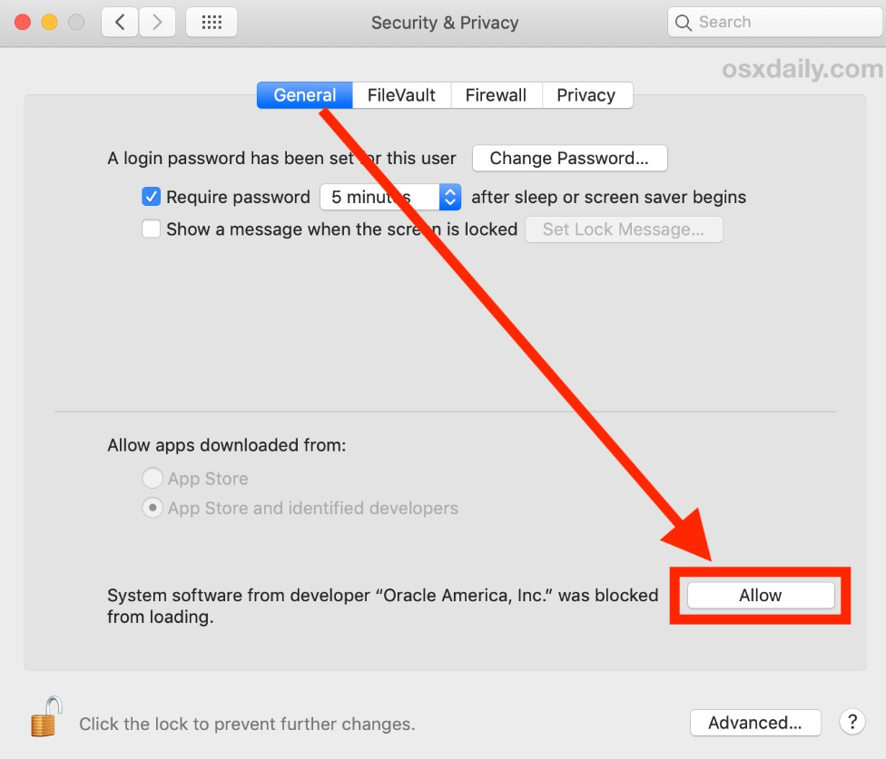


上記の図のように、IfcConvert はブロックされましたというメッセージを見つけて「許可」を押下してください。その後、再度「ターミナルアプリ」から上記コマンドを実行してGLBファイルが生成されることを確認し、正しくIfcConvertの実行されることを確認してください。

##### Unityエディタで IfcConvert の実行ファイルを設定する

デフォルトでは Windows の実行ファイルのパスが設定されていますが、macOSでは Maps Toolkit ウィンドウから環境設定を開き、上記の実行ファイルのパスを `IFC ローダーパス` に設定してください。


設定が完了したら Windowsと同様の手順でMaps ToolkitによるIFCの読み込みができます。

## 3. GISデータ読み込み

Cesium for Unity上にGISデータ（シェープファイルもしくはGeoJSON）を配置します。

[リリースページ](../../releases/tag/SampleFiles)からシェープファイルやGeoJSONファイルのサンプルをダウンロードできます。以下の手順では[SHP_Sample.zip](../../releases/download/SampleFiles/SHP_Sample.zip)を用いて説明します。  
Maps ToolkitでGISデータを扱うためには、緯度経度（WGS84を推奨）が付されたデータが必要です。

GISデータは緯度経度を用いるデータであり、GISデータの読み込みを行う際は緯度経度を用いたオブジェクトの配置を行うために `Cesium Georeference` の設定が必要です。位置合わせの手順を参考に `Cesium Georeference` オブジェクトをシーン内に作成してください。

| 項目 | 説明 |
| --- | --- |
| GIS type | 読み込むファイルに合わせてシェープファイル（SHP）かGeoJSONを選択します。 |
| フォルダパス | シェープファイルもしくはGeoJSONファイルが入っているフォルダを指定します。フォルダに複数のシェープファイルやGeoJSONファイルが入っている場合はすべて描画されます。ファイルサイズやファイルの数が大きすぎると動作が遅くなる可能性があります。参考として、1つのファイルサイズは1MB以内で、フォルダ内に含まれるファイル数は3つまでです。 |
| 配置する高さ | オブジェクトを配置する CesiumGeoreference 上での高度を指定します。 |
| SHPのレンダー方法 | GISデータはメッシュあるいは線として描画することができます。GeoJSONの場合は自動で決定されます（ファイル内のプロパティから自動判断されます）。 |
| GISの線幅 | 描画する先の太さを指定します。SHPのレンダー方法がLineのときのみ表示されます。|

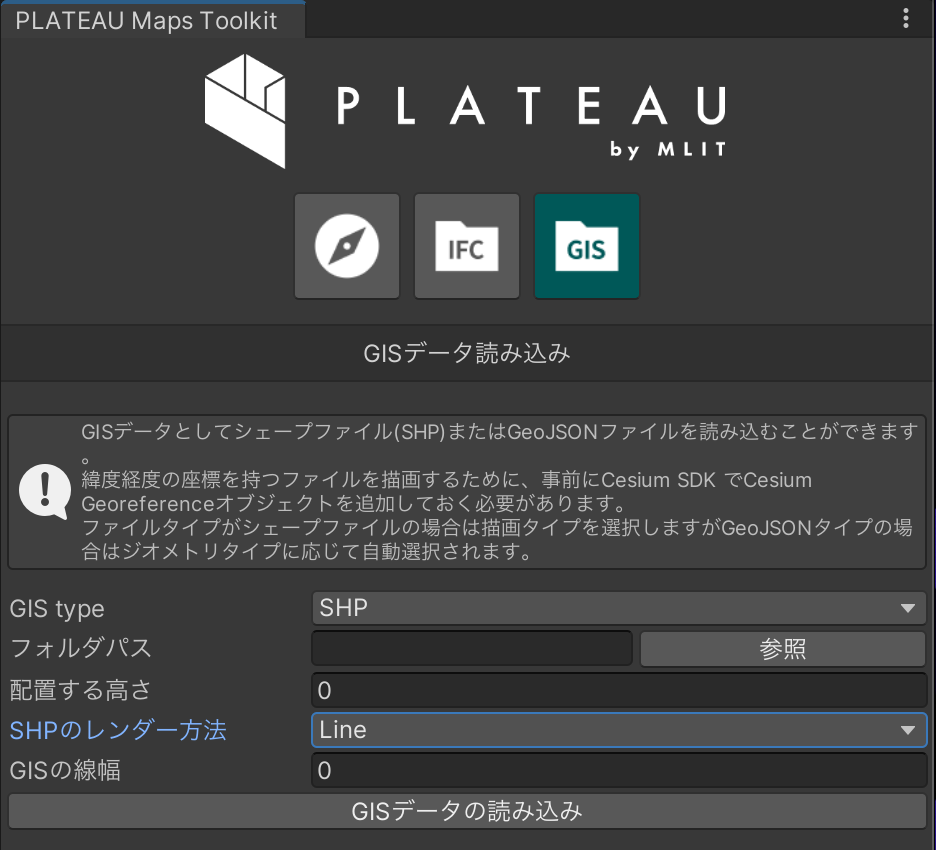

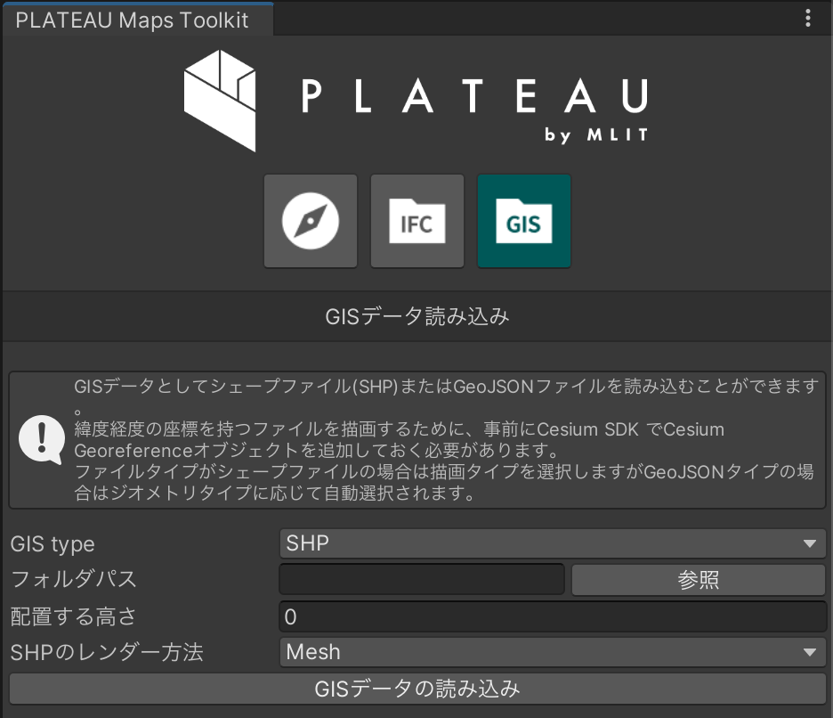


ファイルを指定した後に「GISデータの読み込み」を押すと、でGISオブジェクトが描画されます。

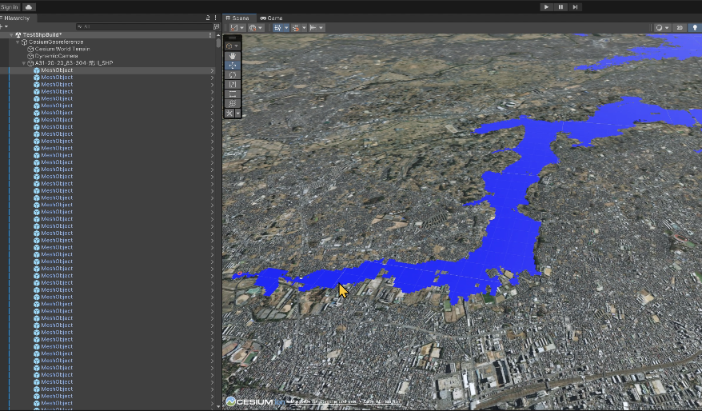


> **Note**
> GISデータはファイルサイズに比例して読み込み時間が長くなります。シェープファイルの合計ファイルサイズは40MB程度以下を推奨します。<br>
> シェープファイルからインポートしたモデルの高さはインポートした際に設定されない場合もあるため、手動で適切な高さに設定する必要があります。


# ライセンス
- 本リポジトリはMITライセンスで提供されています。
- 本システムの開発はユニティ・テクノロジーズ・ジャパン株式会社が行っています。
- ソースコードおよび関連ドキュメントの著作権は国土交通省に帰属します。

# 注意事項/利用規約
- 本ツールをアンインストールした場合、本ツールの機能で作成されたアセットの動作に不備が発生する可能性があります。
- 本ツールをアップデートした際は、一度 Unity エディターを再起動することを推奨しています。
- パフォーマンスの観点から、3km²の範囲に収まる3D都市モデルをダウンロード・インポートすることを推奨しています。
- インポートする範囲の広さや地物の種類（建物、道路、災害リスクなど）が量に比例して処理負荷が高くなる可能性があります。
- 本リポジトリの内容は予告なく変更・削除される可能性があります。
- 本リポジトリの利用により生じた損失及び損害等について、国土交通省はいかなる責任も負わないものとします。
